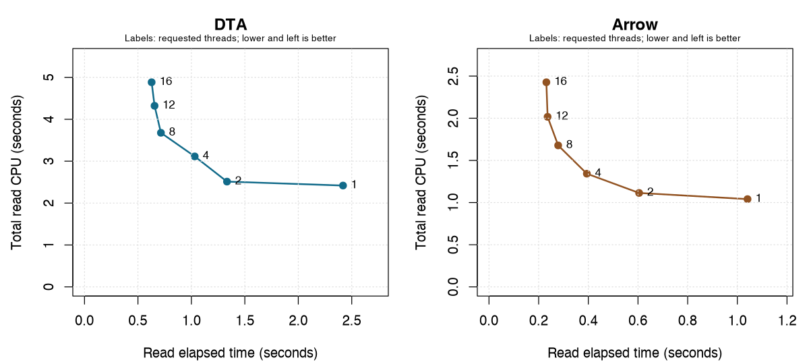

# Reader decoding and parallel CPU, 2026-10-02

The measurements support two parts of the hypothesis: substantial work remains at one thread, and additional workers reduce latency while increasing aggregate CPU. They do not establish that this work is a serialized critical section, or that scheduling alone explains the extra CPU.

The final-v2 build reads one wide dataset: 724,115 rows × 5,972 columns, with matched DTA and profiled Arrow values. Fourteen settings each ran in six fresh processes: 84 observations, warm cache, dibble output. Rotated orders and their reversals balanced precedence. User/system CPU and wall clocks cover the same read interval, excluding package loading and qualification. All settings passed the same complete dataset signature separately; input/library/runtime bindings matched before and after. [Protocol](results-2026-10-02-decode/sweep/protocol.json), [qualification](results-2026-10-02-decode/sweep/qualification.json), [bindings](results-2026-10-02-decode/sweep/provenance-before.json).

## Thread scaling

Times are median seconds; CPU is user plus system across threads. Separately summarized component medians need not sum exactly. These estimates have no confidence intervals. Auto requests `threads = 0`, not a measured worker count. [Summary](results-2026-10-02-decode/sweep/summary.csv), [observations](results-2026-10-02-decode/sweep/raw.jsonl).

| Reader | Threads | Wall | CPU | User | System |
| --- | ---: | ---: | ---: | ---: | ---: |
| DTA | 1 | 2.4185 | 2.4185 | 2.0505 | 0.3680 |
| DTA | 2 | 1.3330 | 2.5125 | 2.0790 | 0.4310 |
| DTA | 4 | 1.0310 | 3.1140 | 2.5835 | 0.5290 |
| DTA | 8 | 0.7150 | 3.6770 | 3.0225 | 0.6565 |
| DTA | 12 | 0.6555 | 4.3215 | 3.4080 | 0.9090 |
| DTA | 16 | 0.6280 | 4.8835 | 3.8205 | 1.0615 |
| DTA | auto | 0.6250 | 4.9020 | 3.8275 | 1.0655 |
| Arrow | 1 | 1.0410 | 1.0410 | 0.6835 | 0.3570 |
| Arrow | 2 | 0.6045 | 1.1140 | 0.7230 | 0.3900 |
| Arrow | 4 | 0.3940 | 1.3425 | 0.8310 | 0.5125 |
| Arrow | 8 | 0.2785 | 1.6780 | 0.8540 | 0.8250 |
| Arrow | 12 | 0.2360 | 2.0170 | 0.8960 | 1.1185 |
| Arrow | 16 | 0.2310 | 2.4270 | 1.0215 | 1.4075 |
| Arrow | auto | 0.2315 | 2.4185 | 1.0150 | 1.4015 |

Two threads buy substantial latency reductions for modest CPU increases: DTA wall falls 44.9% while CPU rises 3.9%; Arrow wall falls 41.9% while CPU rises 7.0%. Returns diminish as concurrency grows. DTA from eight to sixteen threads saves 12.2% wall but costs 32.8% more CPU. Arrow from twelve to sixteen saves 2.1% wall but costs 20.3% more CPU.

Relative to one thread, automatic DTA is 3.87× faster at 2.03× the CPU; Arrow is 4.50× faster at 2.32× the CPU. DTA's extra CPU appears primarily in user time: +1.777 seconds user versus +0.698 system. Arrow's increase appears primarily in system time: +0.332 seconds user versus +1.045 system. System time includes kernel work; it does not identify synchronization overhead by itself.

One thread executes both parallelizable and inherently serial work. It cannot reveal their separate costs. CPU/wall measures concurrent consumption, not useful speedup. Growing aggregate CPU prevents a clean serial-fraction estimate based on fixed-work assumptions.

## Where the profiles point

Five-second captures sampled all threads every millisecond during repeated reads, including waits and between-read collection. Counts are not CPU percentages or comparable throughput across settings.

For DTA, `try_push_byte_rows` leads reader leaves: 2,390 samples at one thread and 22,401 at auto. Numeric decoding and `read` also appear. This targets the strided byte gathering/classification loop, without establishing a serialized bottleneck: parallel workers perform the same work. [One-thread leaves](results-2026-10-02-decode/profiles/dta-1/leaf-functions.csv), [automatic leaves](results-2026-10-02-decode/profiles/dta-0/leaf-functions.csv).

Arrow's one-thread capture includes `read` (837), retained numeric preparation (801), checksums (799) and zeroing (403). Auto is led by `pread` (10,708), numeric preparation (4,815) and checksums (3,536). Rising system CPU makes parallel reading and memory activity worth isolating, but does not distinguish I/O, contention and coordination costs. Wait samples show blocked threads, not CPU spent waiting. [One-thread leaves](results-2026-10-02-decode/profiles/arrow-1/leaf-functions.csv), [automatic leaves](results-2026-10-02-decode/profiles/arrow-0/leaf-functions.csv), [profile bindings](results-2026-10-02-decode/profiles/completion.json).

Earlier synthetic controls also show that switching off parallelism cannot eliminate the gap to native Stata `use`: numeric DTA needed 11.0 ms of one-thread CPU versus 5.415 ms in Stata, or 2.03×; compact DTA needed 53.0 versus 11.162 ms, or 4.75×. Those inputs have matching recorded DTA hashes and the R library matches this final-v2 build. They are different datasets, not native controls for this wide-file sweep. [R serial results](../r-file-readers/results-2026-10-02/serial/summary.csv), [Stata results](../r-file-readers/results-2026-10-02/stata/summary.csv), [Stata input bindings](../r-file-readers/results-2026-10-02/stata/provenance-before.json).

## DTA change retained

The byte gather loop now handles four strided values per iteration with four independent missing-value counters. Format-family dispatch stays outside that loop and contiguous input retains its original traversal. On this arm64 build, the grouped loop uses twenty instructions per four bytes instead of seven per byte, with no hot-loop spills or calls. The larger function and stack frame make measurement necessary. The first private version left format checks inside some lanes and was rejected before timing.

A four-pair screen was followed by a separate eight-pair confirmation across all seven datasets. Confirmation compares the previous final-v2 build with that build plus the byte-loop change, not with the release baseline. It contains 224 observations; every dataset/thread/variant combination passed complete data signatures; the four synthetic fixtures also passed canonical value and full-consumption checks before measurement. Times are seconds; percentages are median paired changes with the runner's 95% bootstrap intervals.

| Wide-file read | Baseline CPU | New CPU | CPU change [95% interval] | Wall change [95% interval] |
| --- | ---: | ---: | --- | --- |
| One thread | 2.4285 | 2.3430 | −3.69% [−4.84, −3.26] | −3.69% [−4.80, −3.26] |
| Automatic | 4.8875 | 4.5930 | −6.56% [−6.97, −5.81] | −3.28% [−3.79, −2.56] |

No read-CPU, read-wall or peak-RSS interval lies wholly above zero in the other six controls. That does not establish equivalence: some short timings have wide intervals and millisecond clock resolution. Four whole-process intervals do show small increases: serial primary-1gb CPU +0.207% and wall +0.175%; serial compact CPU +0.263% and wall +0.251%. Whole-process metrics include startup. All results, including these increases, remain in the tables. [Confirmation](results-2026-10-02-decode/gather-confirm/paired-summary.csv), [screen](results-2026-10-02-decode/gather-screen/paired-summary.csv), [source-bound builds](results-2026-10-02-decode/builds/gather4-v2/build-bindings.json).

The production checkout includes the measured loop and regression tests. Tests cover every raw byte in every gather lane, all ten supported format releases, four strides, short tails, destination guards and accumulated missing counts. This reduces the cost per decoded byte; it leaves most of the measured parallel CPU growth unresolved.

## Arrow stage experiment

A private diagnostic build caps the read/decode stage and column preparation independently after normal worker admission. Each public call still requests sixteen threads, keeps checksum verification and returns a dibble. Preparation includes numeric and string columns. Six cap pairs and a stock-build control ran in six fresh-process rounds, for 42 observations. Every setting passed the same full data signature. Here, stock means the previous final-v2 candidate. The diagnostic 16/16 control and that stock build have nearly identical medians with intervals crossing zero.

| Decode cap | Preparation cap | Wall seconds | CPU seconds | User | System |
| ---: | ---: | ---: | ---: | ---: | ---: |
| 16 | 16 | 0.2320 | 2.4095 | 1.0155 | 1.3965 |
| 16 | 4 | 0.2980 | 2.3540 | 0.9320 | 1.4220 |
| 4 | 16 | 0.3290 | 1.4395 | 0.9190 | 0.5205 |
| 4 | 4 | 0.3950 | 1.3455 | 0.8315 | 0.5145 |
| 12 | 8 | 0.2505 | 2.0030 | 0.8785 | 1.1250 |
| 12 | 12 | 0.2375 | 2.0240 | 0.8980 | 1.1285 |
| Stock 16 | Stock 16 | 0.2320 | 2.4145 | 1.0170 | 1.4000 |

Relative to the diagnostic 16/16 control:

- Limiting only preparation to four saves 2.34% CPU [1.75, 3.44] but raises wall time 28.51% [27.96, 29.59]. Its system CPU increases 1.45% [0.25, 2.89].
- Limiting only decode to four saves 40.51% CPU [39.66, 41.58] and 62.79% system CPU [62.23, 63.73], but raises wall time 42.12% [40.77, 43.29].
- Using twelve for both saves 15.90% CPU [15.48, 17.40] while raising wall time 2.37% [1.29, 3.02].

This localizes most of the sensitivity to the read/decode execution path. One qualification matters: the decode thread count also determines task grouping and contiguous I/O ranges. This experiment changes that grouping along with concurrency. It does not isolate worker scheduling, syscall count or memory contention individually. A follow-up that fixes task geometry while varying execution workers would separate those effects. The source also suggests testing bounded buffer acquisition separately from wider checksum/decode concurrency, since allocation, initialization and reading currently run in the same worker. That is an untested optimization hypothesis. [Phase results](results-2026-10-02-decode/arrow-phases/paired-summary.csv), [protocol](results-2026-10-02-decode/arrow-phases/protocol.json), [diagnostic patch](results-2026-10-02-decode/probes/arrow-phase-caps.patch).

The caps remain a private diagnostic; public defaults are unchanged. These settings offer CPU/latency tradeoffs, and one wide file cannot establish a general default. There is no additional production Arrow change in this follow-up. The earlier span-cache improvement remains in the checkout.

## Validation and limits

The measured candidate passed all 38 native bridge tests and 36,650 installed R assertions, with zero failures, errors or skips. Seven warnings match the previous full-suite run. Clippy passed with warnings denied, and formatting passed. The production package sources and installed test sources match the measured build. R CMD check and the full conformance orchestrator were not rerun in this follow-up. [Validation record](results-2026-10-02-decode/validation.json), [source verification](results-2026-10-02-decode/production-source-verification.json).

The publication includes 398 measured observations across the sweep, initial gather screen, gather confirmation and Arrow phase experiment. It checks the summary point estimates against raw observations and preserves each stage separately. The [artifact inventory](results-2026-10-02-decode/publication-manifest.json) records hashes. [Rerun templates](results-2026-10-02-decode/controllers/README.md) replace only local root assignments in the measured controllers; the transformed copies are syntax checked and explicitly marked as unexecuted.

The sweep's five host-load snapshots and the experiments' eleven snapshots recorded no unrelated process above 50% of one core. Experiment monitoring started during the initial gather screen, so coverage of that screen is partial. This is a shared desktop, and sparse process samples cannot exclude short interference. [Sweep host samples](results-2026-10-02-decode/host-load.jsonl), [experiment host samples](results-2026-10-02-decode/experiment-host-load.jsonl).

The sweep measures one wide file, warm cache and read return. It does not establish cold-storage behavior, later analysis speed, energy savings or a universal thread setting. Bootstrap intervals are unadjusted across many comparisons. The original symptom still reproduces in the sense that automatic reading consumes much more CPU than one-thread reading; the retained byte change reduces a measured component rather than claiming the whole problem is fixed.
